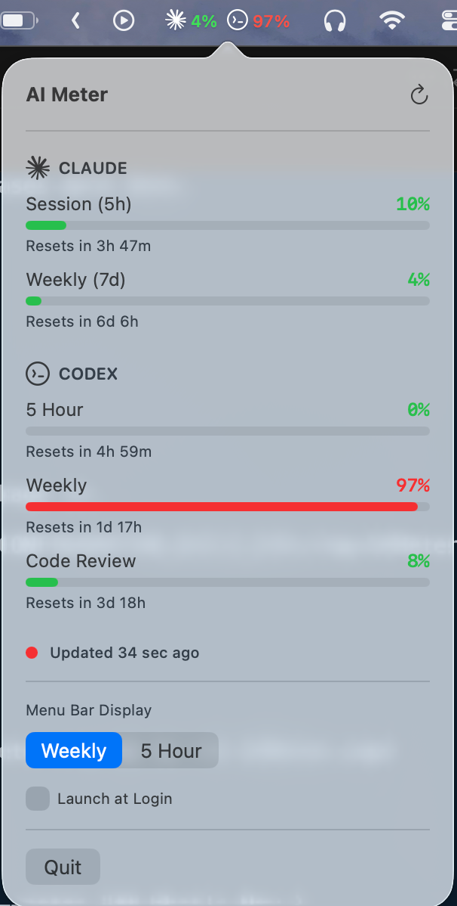

# AI Meter 🔋

A lightweight macOS menu bar app that displays your AI usage limits at a glance. Supports multiple providers including **Claude** and **Codex**.




## Features

- 🤖 **Multi-provider** — Track Claude and Codex usage side by side
- 🔄 **Auto-refresh** — Updates every 2 minutes (configurable)
- 🚦 **Color-coded status** — Green (<70%), Yellow (70-90%), Red (>90%)
- ⏱️ **Reset countdown** — Time until session and weekly limits reset
- 📊 **Session & Weekly limits** — Both displayed in dropdown per provider
- 🔔 **Threshold alerts** — Notifications at 80% and 90% usage
- 🎛️ **Display mode** — Toggle between Weekly and 5-Hour view in menu bar
- 🪶 **Lightweight** — Native Swift, minimal resources

## Installation

### Download
1. Go to [Releases](https://github.com/francisbrero/claude-meter/releases)
2. Download `AIMeter.zip`
3. Unzip and drag `AI Meter.app` to your Applications folder
4. **Right-click** the app and select **"Open"** (important - see below)

### First Launch - Gatekeeper Warning

Since the app is not signed with an Apple Developer certificate, macOS will show a warning. This is normal for open-source apps distributed outside the App Store.

**To open the app:**
1. **Right-click** (or Control-click) on `AI Meter.app`
2. Select **"Open"** from the context menu
3. Click **"Open"** in the dialog that appears

You only need to do this once. After that, the app will open normally.

**If you see "App can't be opened" or accidentally double-clicked:**
1. Go to **System Settings → Privacy & Security**
2. Scroll down to find the AI Meter message
3. Click **"Open Anyway"**

### Build from Source
```bash
git clone https://github.com/francisbrero/claude-meter.git
cd claude-meter/ClaudeMeter
xcodegen generate  # requires XcodeGen: brew install xcodegen
open AIMeter.xcodeproj
```
Then build with ⌘B and run with ⌘R.

## Requirements

- macOS 13.0 (Ventura) or later
- [Claude Code CLI](https://claude.ai/code) and/or [Codex CLI](https://github.com/openai/codex) installed and logged in

## Setup

### Claude
1. Install Claude Code if you haven't already:
   ```bash
   npm install -g @anthropic-ai/claude-code
   ```

2. Log in to Claude Code:
   ```bash
   claude
   ```

### Codex
1. Install Codex CLI and log in:
   ```bash
   codex
   ```

AI Meter reads your credentials from macOS Keychain automatically. Providers that aren't configured will simply not appear in the menu bar.

## How It Works

AI Meter reads your OAuth credentials from macOS Keychain and queries usage API endpoints for each configured provider. Providers are fetched concurrently with automatic retry on network errors.

> **Note:** This uses undocumented APIs that could change at any time. The app will gracefully handle API changes but may stop working if providers modify their endpoints.

## Status Colors

| Status | Color | Usage |
|--------|-------|-------|
| Normal | 🟢 Green | < 70% |
| Warning | 🟡 Yellow | 70-90% |
| Critical | 🔴 Red | > 90% |

## Privacy

- 🔒 Your credentials never leave your machine
- 📵 No analytics or telemetry
- 🚫 No data sent anywhere except provider APIs
- 👀 Open source — verify the code yourself

## Troubleshooting

### "Not logged in to Claude Code"
Run `claude` in Terminal and complete the login flow.

### "Token missing required scope"
Your OAuth token was created before the usage API scope existed. Fix:
```bash
claude logout
claude
```
Then re-authenticate. The new token will have the required `user:profile` scope.

### "App can't be opened" / Gatekeeper warning
See the [Installation section](#first-launch---gatekeeper-warning) above. You need to right-click → Open the first time.

### App doesn't appear in menubar
The icon might be hidden behind the notch on newer MacBooks. Try holding ⌘ (Command) and dragging in the menu bar to rearrange icons. Also check if the app is running in Activity Monitor.

### Usage shows wrong values
Click the refresh button (↻) in the dropdown. If still wrong, your session may have expired — run `claude` or `codex` again.

## Contributing

PRs welcome! Please open an issue first to discuss major changes.

## License

MIT License — do whatever you want with it.

## Disclaimer

This is an unofficial tool not affiliated with Anthropic or OpenAI. It uses undocumented APIs that may change without notice.

---

Made with 🔧 by [@francisbrero](https://github.com/francisbrero)
